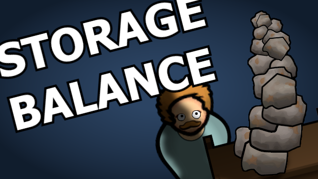
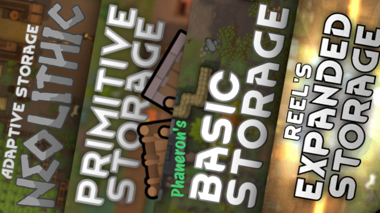

# Rimworld Storage Balance Patches
### by NutritiousCookie

*it's just like, my opinion, man*

This mod contains patches for other storage mods to rebalance their various storage buildings. It is intended to be used with Progression: Storage, although that mod is not required.

The changes made by this mod are listed [here](https://docs.google.com/spreadsheets/d/1aPsodNrzzR2pbRKwGoJjD76U-y6hecBySeb66Cm9250).

## Design philosophy

This mod aims to:
- Declutter menus by removing duplicate items across mods
- Declutter research by removing storage-specific projects, moving buildings to vanilla or vanilla expanded projects.
- Balance around vanilla items.
- Balance stack sizes by tech level and specialization of the shelf, rather than resource cost to build it.

General guidelines for stacks per cell are:

| Tech Level | General Use | Specific Use           |
|:----------:|:-----------:|------------------------|
| Neolithic  | 2-3         | 4-6                    |
| Medieval   | 3-4         | 6-8                    |
| Industrial | 4-6         | 8-10 or extra features |
| Spacer     | 10+         | 20+ or extra features  |

Buildings that are larger or have more restrictive allowed items will tend towards the higher end of the range, and buildings that are smaller, allow more items, or have extra uses will tend towards the lower end.

"Extra features" includes refrigeration, production bonuses, etc.

**Due to compatibility concerns, all changes to research projects are contained in "1.6/Research Patches/", which can be deleted to revert them.**

## Compatability

Currently covering these storage mods:
- [Adaptive Primitive Storage](https://steamcommunity.com/sharedfiles/filedetails/?id=3400037215) - Decreases stack sizes significantly. Reduces some material costs.
- [Adaptive Storage Neolithic Module](https://steamcommunity.com/sharedfiles/filedetails/?id=3033901895) - Reduces some material costs. Removes wood pile if Adaptive Primitive is installed.
- [Reel's Expanded Storage](https://steamcommunity.com/sharedfiles/filedetails/?id=3237638097) - Decreases stack sizes. Removes some items if Adaptive Primitive is installed. Removes research projects. Moves buildings to vanilla projects, or Vanilla Furniture Expanded projects if VFE is installed. Also covers the buildings from [VFE - Props](https://steamcommunity.com/sharedfiles/filedetails/?id=2102143149) and [VFE - Art](https://steamcommunity.com/sharedfiles/filedetails/?id=1968134023) if they are installed.
- [Phaneron's Basic Storage](https://steamcommunity.com/sharedfiles/filedetails/?id=3201536200) - Rebalances stack sizes, mostly small tweaks. Removes crates, barrel, meat hook, and weapon rack if Reel's is installed. Removes research projects. Moves buildings to vanilla projects, or VFE projects if VFE is installed.
- [[sbz] Neat Storage](https://steamcommunity.com/sharedfiles/filedetails/?id=3416243474) - Small rebalance tweaks to crates. Disables crates/weapon racks if Reel's is installed, crates/pallets/weapon racks if Phaneron's is installed.
- [[sbz] Fridge](https://steamcommunity.com/sharedfiles/filedetails/?id=3486264784) - Rebalance costs and power draw. Removes freezers from other mods. Freezers from all mods have a power draw of 20w/stack.
- [Warehouse Storage](https://steamcommunity.com/sharedfiles/filedetails/?id=3519963835) - If any other big storage mods are loaded (Reel's, Phaneron's, Neat, Adaptive Deep, Adaptive Simple) cardboard boxes and medicine racks are removed. Storage shelves have chunks/corpses disallowed.
- [Adaptive Ideology Storage](https://steamcommunity.com/sharedfiles/filedetails/?id=3301337278) - Now compatible. All items renamed and rebalanced.

Research projects are removed, and items are instead assigned to projects from:
- Vanilla (no required DLCs)
- [Vanilla Furniture Expanded - Core](https://steamcommunity.com/sharedfiles/filedetails/?id=1718190143)
- [Vanilla Furniture Expanded - Art](https://steamcommunity.com/sharedfiles/filedetails/?id=1968134023)
- [Vanilla Furniture Expanded - Spacer](https://steamcommunity.com/sharedfiles/filedetails/?id=2028381079)
- [Medieval Overhaul](https://steamcommunity.com/sharedfiles/filedetails/?id=3219596926)

Made with compatibility in mind for these other mods:
- [Progression: Storage](https://steamcommunity.com/sharedfiles/filedetails/?id=3292746186)
- [Restore Content - Progression: Storage](https://steamcommunity.com/sharedfiles/filedetails/?id=3417113151)
- [Better Architect Menu](https://steamcommunity.com/sharedfiles/filedetails/?id=3563882422)
- [Medieval Overhaul](https://steamcommunity.com/sharedfiles/filedetails/?id=3219596926)

## Q&A

**Q:** Why do some similar items across mods have different costs/stack sizes?

**A:** This mod is intended to balance mods closer to each other, and bring the worst offenders in stack size/material cost in line. Some idiosyncrasies of individual mods will still appear. Depending on which mods you have installed, your stone pots, meat hooks, etc might have slightly different costs, stack sizes, and allowed items.

**Q:** Why don't you support (insert mod here)?

**A:** If a mod is not listed in the description, I have not taken the time to add a patch for it. That does not mean it is incompatible, just that I have not rebalanced it. Let me know if there's a mod you would like me to take a look at and I may get around to it.

## Installation

### [Steam Workshop](https://steamcommunity.com/sharedfiles/filedetails/?id=3566687115)

### Manual

Download and unzip into your `RimWorld/Mods/` folder. Sort it after all of the above mods.

Alternatively, use **[RimSort](https://github.com/RimSort/RimSort)**, the modern, actively developed, open-source modloader for RimWorld, and add this repository in `Download` > `Add Git Mod`. RimSort will sort this mod correctly.

## Usage, permissions, etc

Modding is a community effort that should never be constrained by money or author egos. Use, change, and distribute this mod as you wish. If something feels wrong or bothers you, contribute to the community by making a patch and uploading it for everyone.